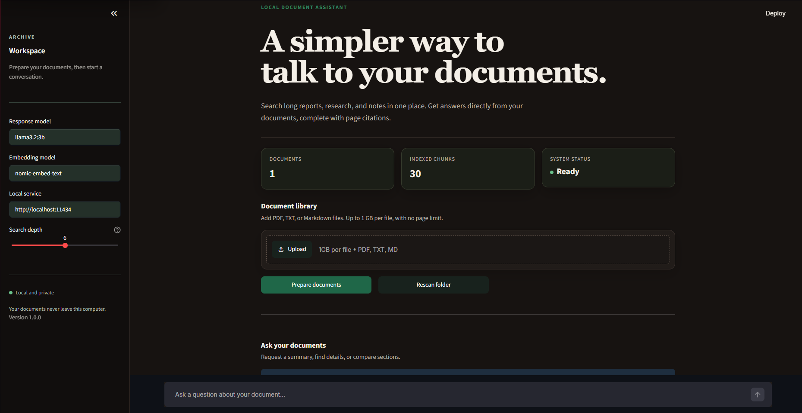

# Local Document RAG Assistant

A privacy-first document assistant that runs entirely on your machine. It indexes PDF, TXT, and Markdown files with Ollama embeddings, stores vectors in ChromaDB, and produces page-cited answers with a local Llama model.




## Features

- Fully local inference; documents are not sent to a cloud service
- PDF, TXT, and Markdown ingestion with page metadata
- Persistent ChromaDB vector index
- Source citations in every answer
- English Streamlit interface and assistant responses
- Up to 1 GB per uploaded file
- Memory-conscious batch processing for large documents
- Sensible defaults for GPUs with 8 GB VRAM

## Architecture

```text
Document -> page-aware chunks -> Ollama embeddings -> ChromaDB
                                                        |
Question -> semantic retrieval -> relevant context -> Llama -> cited answer
```

| Component | Responsibility |
| --- | --- |
| `app.py` | Streamlit interface and upload workflow |
| `src/pdf_loader.py` | File discovery and page-aware text extraction |
| `src/chunker.py` | Overlapping text chunking |
| `src/embedder.py` | Ollama embedding client |
| `src/vector_store.py` | Persistent indexing and similarity search |
| `src/retriever.py` | Context assembly with source metadata |
| `src/llm.py` | Grounded Llama response generation |
| `src/rag.py` | End-to-end RAG orchestration |

## Requirements

- Python 3.11 or newer; Python 3.11/3.12 is recommended
- [Ollama](https://ollama.com/) running locally
- Approximately 4 GB of free disk space for the default models
- A GPU with 8 GB VRAM is recommended, but CPU inference also works

## Quick start

```powershell
ollama pull llama3.2:3b
ollama pull nomic-embed-text

python -m venv .venv
.\.venv\Scripts\Activate.ps1
pip install -r requirements.txt
streamlit run app.py
```

On Windows, the included scripts provide a shorter workflow:

```powershell
.\scripts\setup_models.ps1
.\scripts\run_local.ps1
```

Open [http://localhost:8501](http://localhost:8501), upload a document, select **Prepare documents**, and ask a question.

You can also copy files into `documents/` and use **Rescan folder**.

## VRAM profile

The default configuration targets GPUs with 8 GB VRAM:

- Chat model: `llama3.2:3b`
- Context window: 4,096 tokens
- Generation batch: 128
- Embedding batch: 32 chunks
- Model keep-alive: 2 minutes

For smaller GPUs, select `llama3.2:1b` in the sidebar. Larger models can be selected on higher-memory systems.

## Tests

```powershell
python -m unittest discover -v
python -m compileall -q app.py src tests
```

Pull requests run the same checks automatically through GitHub Actions.

## Repository structure

```text
.github/       Pull request template and CI workflow
assets/        Interface preview and repository media
database/      Local ChromaDB data (ignored)
docs/          Architecture and usage documentation
documents/     Local source documents (ignored)
scripts/       PowerShell setup, start, and stop commands
src/           RAG application modules
tests/         Unit tests
app.py         Streamlit entry point
```

See [Architecture](docs/ARCHITECTURE.md) for the data flow and [Usage Guide](docs/USAGE.md) for detailed instructions.

## Limitations

- Image-only PDFs require OCR, which is not included in this release.
- A 1 GB upload limit does not guarantee that every 1 GB PDF can be processed within available system RAM.
- Retrieval quality depends on the text layer and structure of the source document.

## Versioning

This project follows [Semantic Versioning](https://semver.org/). See [CHANGELOG.md](CHANGELOG.md) for release history.
